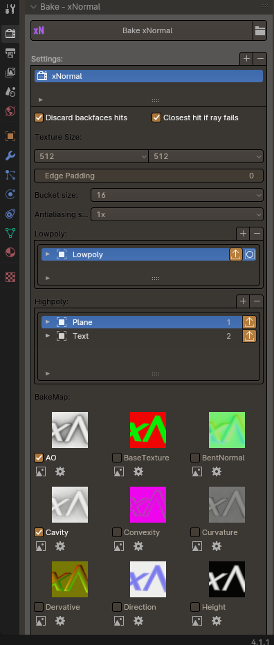

# xNormal Baker

## 概要 (Overview)
`xNormal Baker`はxNormalでのテクスチャベイクを自動化するBlenderアドオンです  
`xNormal Baker` is an addon designed to automate the baking process by integrating Blender with xNormal.

特長としてシェイプキーをケージメッシュとして使用でき、煩雑なケージメッシュでのベイク処理が手軽に行えます  
One of the standout features of `xNormal Baker` is the ability to use **shape keys as cage meshes**, providing greater flexibility and precision during the baking process.

## スクリーンショット (Screenshots)

## 主な機能 (Key Features)
- シェイプキーをケージメッシュとして使用可能  
  Use shape keys as cage meshes for precise control over baking.
- マテリアルマスクを使用して不要なマテリアルをベイク対象から除外  
  Exclude unnecessary materials from baking using material masks.
- サンプルベイクで個別のテクスチャベイクを即座にプレビュー  
  Instantly preview individual texture bakes with sample baking.
- Blender上からxNormalの主要なベイク設定にアクセス可能  
  Access most of xNormal's key baking settings directly from Blender.

## インストール方法 (Installation)
`xNormal Baker`のインストール手順は以下の通り：  
To install `xNormal Baker` as a Blender addon, follow these steps:

1. **アドオンをダウンロード (Download the Addon)**  
   - 緑色の「Code」ボタンをクリックし、「Download ZIP」を選択  
     Click the green "Code" button and select "Download ZIP".
   - ZIPファイルをローカル保存します  
     Save the ZIP file to your local machine.

2. **Blenderにアドオンをインストール (Install the Addon in Blender)**  
   - Blenderを開き、`Edit > Preferences > Add-ons`に移動します  
     Open Blender and go to `Edit > Preferences > Add-ons`.
   - 右上の「Install」ボタンをクリック  
     Click the "Install" button at the top-right corner.
   - ダウンロードしたZIPファイルを選択し、「Install Add-on」をクリック  
     Select the downloaded ZIP file and click "Install Add-on".

3. **アドオンを有効化 (Enable the Addon)**  
   - 「xNormal Baker」を検索します  
     Search for "xNormal Baker" in the Add-ons search bar.
   - チェックボックスをオンにしてアドオンを有効化  
     Enable the addon by checking the checkbox.

4. **xNormalのパスを設定 (Configure xNormal Path)**  
   アドオン設定で、xNormalの実行ファイルのパスが正しく設定されていることを確認してください  
   Ensure that the path to the xNormal executable is correctly set in the addon preferences.

## 連絡先 (Contact)
[https://odonata.xyz/](https://odonata.xyz/)  
[@odonata_xyz](https://twitter.com/odonata_xyz)